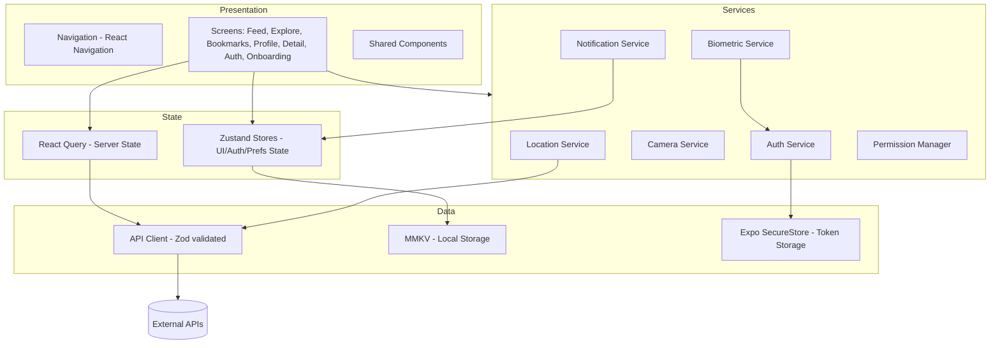

# Design Document: Trendify

## Overview

Trendify is a React Native mobile application (Expo-managed workflow) that aggregates trending content from public/placeholder APIs and surfaces it to users with a personalized, location-aware feed. The app demonstrates industry-standard React Native practices including TypeScript strict mode, Zustand for global state, React Query for server state, and property-based testing.

The architecture follows a layered approach:
- **Presentation Layer**: React Native screens and components
- **State Layer**: Zustand stores (global/UI state) + React Query (server/cache state)
- **Service Layer**: Auth, Biometric, Camera, Location, Notification services
- **Data Layer**: API Client (typed, Zod-validated) + local persistence (MMKV)

---

## Architecture



### Key Technology Decisions

| Concern | Choice | Rationale |
|---|---|---|
| Framework | Expo (managed) | Simplifies native module access for camera, location, notifications, biometrics |
| Navigation | React Navigation v6 | Industry standard; supports bottom tabs + nested stacks |
| Global state | Zustand | Lightweight, TypeScript-friendly, no boilerplate |
| Server state | React Query (TanStack Query) | Caching, background refetch, pagination, offline support |
| Local storage | MMKV | Faster than AsyncStorage; synchronous reads; good for bookmarks/prefs |
| Secure storage | Expo SecureStore | Encrypted key-value for auth tokens |
| Schema validation | Zod | Runtime API response validation with TypeScript inference |
| Biometrics | Expo LocalAuthentication | Cross-platform Face ID / fingerprint |
| Camera | Expo Camera | Managed workflow compatible |
| Location | Expo Location | Managed workflow compatible |
| Notifications | Expo Notifications | Handles both push and local notifications |
| Testing (unit) | Jest + React Native Testing Library | Standard RN testing stack |
| Testing (property) | fast-check | Mature PBT library for TypeScript |

---

## Components and Interfaces

### Navigation Structure

```
RootNavigator (Stack)
├── OnboardingNavigator (Stack) — shown on first launch
│   ├── WelcomeScreen
│   ├── FeatureIntroScreen
│   ├── PermissionsScreen
│   └── BiometricSetupScreen
├── AuthNavigator (Stack) — shown when unauthenticated
│   ├── LoginScreen
│   └── RegisterScreen
└── MainNavigator (Bottom Tabs) — shown when authenticated
    ├── FeedTab (Stack)
    │   ├── FeedScreen
    │   └── TrendItemDetailScreen
    ├── ExploreTab (Stack)
    │   ├── ExploreScreen
    │   └── TrendItemDetailScreen
    ├── BookmarksTab (Stack)
    │   └── BookmarksScreen
    └── ProfileTab (Stack)
        └── ProfileScreen
```

### Service Interfaces

```typescript
// Auth Service
interface AuthService {
  register(email: string, password: string): Promise<AuthResult>;
  login(email: string, password: string): Promise<AuthResult>;
  logout(): Promise<void>;
  restoreSession(): Promise<AuthToken | null>;
  storeToken(token: AuthToken): Promise<void>;
  clearToken(): Promise<void>;
}

// Biometric Service
interface BiometricService {
  isAvailable(): Promise<boolean>;
  authenticate(reason: string): Promise<BiometricResult>;
  enableBiometricLogin(): Promise<void>;
  disableBiometricLogin(): Promise<void>;
}

// Camera Service
interface CameraService {
  openCamera(): Promise<CaptureResult | null>;
  requestPermission(): Promise<PermissionStatus>;
}

// Location Service
interface LocationService {
  getCurrentCoordinates(timeoutMs: number): Promise<Coordinates | null>;
  resolveRegionCode(coords: Coordinates): Promise<string>;
  requestPermission(): Promise<PermissionStatus>;
}

// Notification Service
interface NotificationService {
  register(): Promise<string | null>; // returns push token
  scheduleDaily(hour: number, minute: number): Promise<void>;
  cancelScheduled(): Promise<void>;
  requestPermission(): Promise<PermissionStatus>;
}

// Permission Manager
interface PermissionManager {
  requestAll(): Promise<PermissionResults>;
  getStatus(type: PermissionType): Promise<PermissionStatus>;
  recordDenial(type: PermissionType): void;
}

// API Client
interface APIClient {
  fetchTrendItems(params: FetchTrendParams): Promise<TrendItemPage>;
  fetchTrendItemById(id: string): Promise<TrendItem>;
}
```

### Zustand Stores

```typescript
// Auth Store
interface AuthStore {
  token: AuthToken | null;
  user: UserProfile | null;
  isAuthenticated: boolean;
  setToken(token: AuthToken): void;
  clearAuth(): void;
}

// Preferences Store
interface PreferencesStore {
  categories: Category[];
  notificationsEnabled: boolean;
  locationEnabled: boolean;
  biometricEnabled: boolean;
  dailyReminderTime: { hour: number; minute: number } | null;
  setCategories(cats: Category[]): void;
  setNotificationsEnabled(val: boolean): void;
  setLocationEnabled(val: boolean): void;
  setBiometricEnabled(val: boolean): void;
  setDailyReminderTime(time: { hour: number; minute: number } | null): void;
}

// Bookmarks Store
interface BookmarksStore {
  bookmarks: TrendItem[];
  addBookmark(item: TrendItem): void;
  removeBookmark(id: string): void;
  isBookmarked(id: string): boolean;
}
```

### React Query Keys and Hooks

```typescript
// Query key factory
const queryKeys = {
  trendItems: (params: FetchTrendParams) => ['trendItems', params] as const,
  trendItemDetail: (id: string) => ['trendItem', id] as const,
};

// Custom hooks
function useTrendFeed(params: FetchTrendParams): UseInfiniteQueryResult<TrendItemPage>
function useTrendItemDetail(id: string): UseQueryResult<TrendItem>
```

---

## Data Models

### Domain Types

```typescript
type PermissionType = 'camera' | 'location' | 'notifications';
type PermissionStatus = 'granted' | 'denied' | 'undetermined';
type Category = 'technology' | 'sports' | 'finance' | 'entertainment' | 'health' | 'science';

interface AuthToken {
  accessToken: string;
  expiresAt: number; // unix timestamp
}

interface AuthResult {
  success: boolean;
  token?: AuthToken;
  error?: string;
}

interface BiometricResult {
  success: boolean;
  error?: string;
}

interface CaptureResult {
  uri: string;
  width: number;
  height: number;
}

interface Coordinates {
  latitude: number;
  longitude: number;
  accuracy?: number;
}

interface UserProfile {
  id: string;
  email: string;
  displayName: string;
}

interface TrendItem {
  id: string;
  title: string;
  description: string;
  source: string;
  publishedAt: string; // ISO 8601
  imageUrl?: string;
  url: string;
  category: Category;
  regionCode?: string;
}

interface TrendItemPage {
  items: TrendItem[];
  nextCursor?: string;
  totalCount: number;
}

interface FetchTrendParams {
  categories?: Category[];
  regionCode?: string;
  cursor?: string;
  pageSize?: number;
}

interface PermissionResults {
  camera: PermissionStatus;
  location: PermissionStatus;
  notifications: PermissionStatus;
}
```

### Zod Schemas (API validation)

```typescript
const TrendItemSchema = z.object({
  id: z.string(),
  title: z.string(),
  description: z.string(),
  source: z.string(),
  publishedAt: z.string().datetime(),
  imageUrl: z.string().url().optional(),
  url: z.string().url(),
  category: z.enum(['technology', 'sports', 'finance', 'entertainment', 'health', 'science']),
  regionCode: z.string().optional(),
});

const TrendItemPageSchema = z.object({
  items: z.array(TrendItemSchema),
  nextCursor: z.string().optional(),
  totalCount: z.number().int().nonnegative(),
});

const AuthTokenSchema = z.object({
  accessToken: z.string(),
  expiresAt: z.number().int().positive(),
});

// Inferred types match domain types above
type TrendItem = z.infer<typeof TrendItemSchema>;
type TrendItemPage = z.infer<typeof TrendItemPageSchema>;
type AuthToken = z.infer<typeof AuthTokenSchema>;
```

### Local Storage Schema (MMKV)

| Key | Type | Description |
|---|---|---|
| `bookmarks` | `TrendItem[]` (JSON) | Saved trend items |
| `preferences` | `PreferencesStore` (JSON) | User category/notification/location prefs |
| `onboarding_complete` | `boolean` | Whether onboarding has been completed |
| `permission_denials` | `PermissionType[]` (JSON) | Permissions denied during onboarding |


---

## Correctness Properties

*A property is a characteristic or behavior that should hold true across all valid executions of a system — essentially, a formal statement about what the system should do. Properties serve as the bridge between human-readable specifications and machine-verifiable correctness guarantees.*

### Property 1: Permission denial is recorded for all permission types

*For any* permission type (camera, location, notifications), if the user denies that permission during onboarding, the Permission Manager's recorded denial set should contain that permission type.

**Validates: Requirements 1.3**

---

### Property 2: Onboarding completion flag persists

*For any* app session, after the user completes the Onboarding Flow, the locally stored `onboarding_complete` flag should be truthy, and a subsequent call to check whether onboarding should be shown should return false.

**Validates: Requirements 1.4**

---

### Property 3: Auth token round-trip

*For any* valid auth token returned by a successful login, storing the token and then calling `restoreSession` should return an equivalent token with the same `accessToken` and `expiresAt` values.

**Validates: Requirements 2.2, 2.4**

---

### Property 4: Invalid credential errors are non-specific

*For any* combination of invalid email and/or password, the error message returned by the Auth Service should not contain the words "email", "password", "username", or any field-specific identifier that reveals which field is incorrect.

**Validates: Requirements 2.3**

---

### Property 5: Logout clears all auth state

*For any* authenticated session (with a stored token), after calling logout, the token store should be empty (null) and the auth store's `isAuthenticated` flag should be false.

**Validates: Requirements 2.6**

---

### Property 6: Category preferences are included in API requests

*For any* non-empty set of category preferences saved to the Preferences Store, the parameters passed to `APIClient.fetchTrendItems` should include all of those categories.

**Validates: Requirements 3.2, 8.2**

---

### Property 7: Network error produces error state with retry

*For any* network error thrown by the API Client, the Trend Feed's query state should transition to an error state, and the rendered component should contain both an error message and a retry affordance.

**Validates: Requirements 3.5**

---

### Property 8: Bookmark round-trip

*For any* TrendItem, after calling `addBookmark(item)`, the Bookmarks Store should contain an item with the same `id`, and `isBookmarked(item.id)` should return true. The item should also be persisted to MMKV storage.

**Validates: Requirements 4.4, 9.1**

---

### Property 9: Bookmark removal clears storage

*For any* bookmarked TrendItem, after calling `removeBookmark(item.id)`, the Bookmarks Store should not contain that item, `isBookmarked(item.id)` should return false, and the item should no longer exist in MMKV storage.

**Validates: Requirements 9.4**

---

### Property 10: Location coordinates produce region code in API params

*For any* valid `Coordinates` object (latitude in [-90, 90], longitude in [-180, 180]), when the Location Service resolves a region code from those coordinates, the subsequent `fetchTrendItems` call should include that region code as a parameter.

**Validates: Requirements 5.2**

---

### Property 11: Preference toggle applies to service registration

*For any* boolean preference value (notifications or location enabled), toggling the preference in the Preferences Store should result in the corresponding service (Notification Service or Location Service) being enabled or disabled to match the new preference value.

**Validates: Requirements 8.3, 8.4**

---

### Property 12: Permission status is accurately reflected in Profile screen

*For any* combination of permission statuses (granted/denied/undetermined) for camera, location, and notifications, the Profile screen should render the correct status label for each permission type.

**Validates: Requirements 8.5**

---

### Property 13: All interactive elements have accessibility labels

*For any* rendered screen component, every element with an `onPress` handler or that is otherwise interactive should have a non-empty `accessibilityLabel` prop.

**Validates: Requirements 11.1**

---

### Property 14: All interactive elements meet minimum touch target size

*For any* rendered interactive element, its layout dimensions should be at least 44 points in both width and height.

**Validates: Requirements 11.3**

---

### Property 15: Zod schema rejects invalid API responses

*For any* object that does not conform to `TrendItemSchema` (e.g., missing required fields, wrong types), parsing it with the schema should return a `ZodError` rather than a valid `TrendItem`.

**Validates: Requirements 12.6**

---

### Property 16: API serialization round-trip

*For any* valid `TrendItem` domain object, serializing it to a raw API payload and then deserializing it back should produce an object equivalent to the original (same field values). Formally: `deserialize(serialize(item))` is deeply equal to `item`.

**Validates: Requirements 12.7**

---

## Error Handling

### Auth Errors
- Invalid credentials: return generic error message (no field specificity)
- Token expired: clear stored token, redirect to login screen
- Network failure during auth: surface retry prompt, do not clear existing session

### API / Network Errors
- Network unavailable: React Query enters error state; Trend Feed shows error message + retry button
- API returns non-2xx: Zod parse is skipped; error is surfaced to React Query error state
- Zod parse failure: log schema mismatch, surface generic "content unavailable" message, do not crash

### Location Errors
- Permission denied: disable location-based filtering, fetch global content
- Timeout (>10s): fall back to global content without region code parameter
- GPS unavailable: same as timeout fallback

### Camera Errors
- Permission denied: show settings deep-link prompt instead of camera UI
- Capture failure: show error toast, return user to previous state

### Notification Errors
- Permission denied: show in-Profile prompt with settings deep link
- Registration failure: log silently, disable push notification features gracefully

### Biometric Errors
- Hardware unavailable: skip biometric option in onboarding
- Authentication failure: fall back to password login prompt

### Offline / Storage Errors
- No network + no cache: show offline message, direct user to Bookmarks screen
- MMKV write failure: log error, surface toast; do not crash
- SecureStore failure: log error, require re-login

---

## Testing Strategy

### Dual Testing Approach

Both unit tests and property-based tests are required. They are complementary:
- Unit tests catch concrete bugs with specific inputs and verify integration points
- Property tests verify universal correctness across all valid inputs

### Unit Testing

**Framework**: Jest + React Native Testing Library

Unit tests focus on:
- Specific examples demonstrating correct behavior (e.g., login success flow, navigation to detail screen)
- Integration points between components and services (e.g., React Query hook + API Client)
- Edge cases and error conditions (e.g., offline state, permission denied flows)
- Snapshot tests for key screen layouts

Avoid writing unit tests that duplicate what property tests already cover broadly.

### Property-Based Testing

**Framework**: fast-check (TypeScript-native PBT library)

**Configuration**: Each property test must run a minimum of 100 iterations (`numRuns: 100` in fast-check config).

Each property test must include a comment referencing the design property it validates:
```
// Feature: trendify, Property N: <property_text>
```

**Property test mapping** (one test per property):

| Property | Test Description | fast-check Arbitraries |
|---|---|---|
| P1: Permission denial recorded | Generate random PermissionType, deny it, check recorded set | `fc.constantFrom('camera', 'location', 'notifications')` |
| P2: Onboarding flag persists | Complete onboarding, check flag | `fc.constant(true)` (example-style) |
| P3: Auth token round-trip | Generate random token, store + restore | `fc.record({ accessToken: fc.string(), expiresAt: fc.integer({ min: 1 }) })` |
| P4: Non-specific error messages | Generate invalid credential pairs, check error text | `fc.tuple(fc.emailAddress(), fc.string({ minLength: 1 }))` |
| P5: Logout clears auth state | Generate authenticated state, logout, check empty | `fc.record({ accessToken: fc.string(), expiresAt: fc.integer({ min: 1 }) })` |
| P6: Categories in API params | Generate category sets, save prefs, check API call | `fc.array(fc.constantFrom(...categories), { minLength: 1 })` |
| P7: Network error → error state | Generate error types, check feed state | `fc.constantFrom(new NetworkError(), new TimeoutError())` |
| P8: Bookmark round-trip | Generate TrendItem, bookmark it, check store + MMKV | `fc.record({ id: fc.uuid(), title: fc.string(), ... })` |
| P9: Bookmark removal clears storage | Generate bookmarked item, remove it, check absent | Same TrendItem arbitrary |
| P10: Location → region code in params | Generate valid coordinates, check API params | `fc.record({ latitude: fc.float({ min: -90, max: 90 }), longitude: fc.float({ min: -180, max: 180 }) })` |
| P11: Preference toggle applies to service | Generate boolean, toggle pref, check service state | `fc.boolean()` |
| P12: Permission status in Profile | Generate permission state combos, check render | `fc.record({ camera: fc.constantFrom(...statuses), ... })` |
| P13: Accessibility labels present | Generate screen props, render, check all interactive elements | Component-specific arbitraries |
| P14: Touch target size ≥ 44pt | Generate screen props, render, check layout | Component-specific arbitraries |
| P15: Zod rejects invalid responses | Generate objects missing required fields, check ZodError | `fc.record({ id: fc.option(fc.string()), ... })` with missing fields |
| P16: Serialization round-trip | Generate valid TrendItem, serialize + deserialize, check equality | Full TrendItem arbitrary |

### Test File Organization

```
src/
  __tests__/
    unit/
      auth.test.ts
      bookmarks.test.ts
      navigation.test.ts
      feed.test.ts
      profile.test.ts
    property/
      auth.property.test.ts        # P3, P4, P5
      permissions.property.test.ts # P1, P2, P12
      bookmarks.property.test.ts   # P8, P9
      feed.property.test.ts        # P6, P7, P10
      preferences.property.test.ts # P11
      accessibility.property.test.ts # P13, P14
      api-schema.property.test.ts  # P15, P16
```
